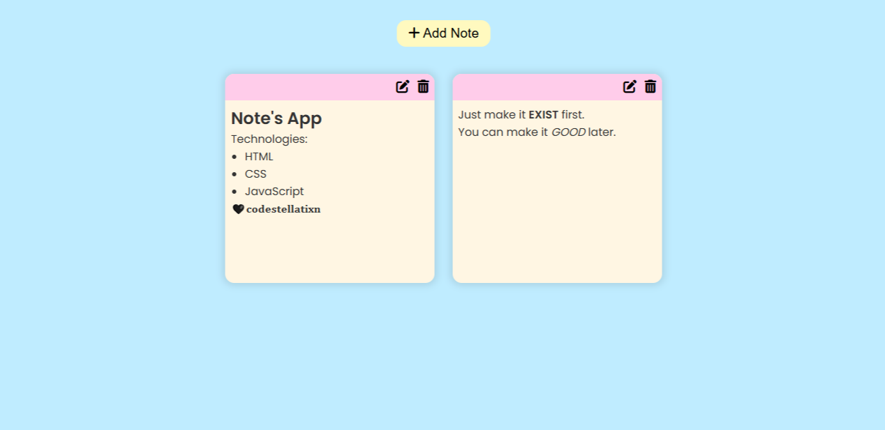

# Notes App 📒

A simple and minimalistic notes application built with HTML, CSS, and JavaScript. The app allows users to create, edit, and delete notes while saving them in local storage for persistence. It also supports markdown formatting using the **marked** library.



## Features ✨
- Add new notes with a single click.
- Edit notes using a text area.
- Supports basic markdown syntax (including lists and headings).
- Autosave notes with debounce for performance optimization.
- Delete unwanted notes.
- Responsive and mobile-friendly design.
- Notes are stored in local storage, so they persist on page reload.

## Live Demo 🌐
Check out the live demo [here](https://codestellatixn.github.io/js-notes-app/)

## Technologies Used 🛠️
- **HTML**
- **CSS** (including responsive design)
- **JavaScript**
- **Marked.js** (for markdown support)

## Getting Started 🚀
1. Clone the repository:
   ```bash
   git clone https://github.com/your-username/notes-app.git
   ```
2. Navigate into the project folder:
   ```bash
   cd notes-app
   ```
3. Open the `index.html` file in your preferred browser:
   ```bash
   open index.html
   ```

## Deploy on GitHub Pages 🌐
1. Create a `gh-pages` branch:
   ```bash
   git checkout -b gh-pages
   ```
2. Push the branch to GitHub:
   ```bash
   git push origin gh-pages
   ```
3. Go to your repository on GitHub and navigate to **Settings** → **Pages**.
4. Select the `gh-pages` branch as the source and save.
5. Your app will be live at:
   ```
   https://your-username.github.io/notes-app/
   ```

## License 📝
This project is licensed under the MIT License.

## Contributing 🤝
Feel free to fork this repository and submit pull requests. Any improvements or suggestions are welcome!

---
Give a ⭐ if you like the project!

